# Steering Policy Maker — Adaptive Workflow Overview

**Purpose**: Technical reference for AI model and developers to understand the complete Steering Policy Maker workflow structure.

**Note**: Similar content exists in core-workflow.md (detailed execution instructions) and welcome-message.md (user-facing introduction). This duplication is INTENTIONAL — each file serves a different purpose:
- **This file**: Concise technical reference with Mermaid diagram for AI model context loading
- **core-workflow.md**: Complete execution instructions with all rules and procedures
- **welcome-message.md**: User-friendly introduction displayed once at start

## The Four-Phase Lifecycle

- **DISCOVERY PHASE**: Understanding and Research (WHAT and WHY)
- **DESIGN PHASE**: Architecture and Planning (HOW to structure the policy set)
- **GENERATION PHASE**: File Creation (BUILD the steering policies)
- **REFINEMENT PHASE**: Quality Assurance (VERIFY and CALIBRATE to AI-DLC standards)

## The Adaptive Workflow

**Purpose Analysis** (always) → **Domain Research** (always, adaptive depth) → **Stakeholder Identification** (conditional) → **Scope Definition** (always) → **Workflow Architecture** (always) → **Common Rules Design** (always) → **Phase Rules Design** (always) → **Quality Mechanisms Design** (always) → **Core Workflow Generation** (always) → **Common Rules Generation** (always) → **Phase Rules Generation** (always) → **Integration Validation** (always) → **Completeness Review** (always) → **Consistency Review** (always) → **Quality Calibration** (always)

## How It Works

- **AI analyzes** the user's target agent purpose, domain, and complexity to determine appropriate depth and scope
- **These stages always execute**: Purpose Analysis, Domain Research, Scope Definition, all DESIGN stages, all GENERATION stages, all REFINEMENT stages
- **Conditional stages**: Stakeholder Identification (only if multiple user types)
- **Adaptive depth**: Domain Research adapts from minimal to comprehensive based on domain complexity
- **Quality benchmark**: All output is calibrated against the AI-DLC reference implementation's 11 quality dimensions

## User's Role

- **Answer questions** in dedicated question files using [Answer]: tags with letter choices (A, B, C, D, E)
- **"Other" option available**: Choose "Other" and describe your custom response if provided options don't match
- **Review and approve** each phase before proceeding
- **Provide domain expertise** when the AI needs domain-specific information

## Steering Policy Maker — Four-Phase Workflow

```mermaid
flowchart TD
    Start(["User Purpose"])

    subgraph DISCOVERY["DISCOVERY PHASE"]
        PA["Purpose Analysis<br/><b>ALWAYS</b>"]
        DR["Domain Research<br/><b>ALWAYS</b>"]
        SI["Stakeholder Identification<br/><b>CONDITIONAL</b>"]
        SD["Scope Definition<br/><b>ALWAYS</b>"]
    end

    subgraph DESIGN["DESIGN PHASE"]
        WA["Workflow Architecture<br/><b>ALWAYS</b>"]
        CRD["Common Rules Design<br/><b>ALWAYS</b>"]
        PRD["Phase Rules Design<br/><b>ALWAYS</b>"]
        QMD["Quality Mechanisms Design<br/><b>ALWAYS</b>"]
    end

    subgraph GENERATION["GENERATION PHASE"]
        CWG["Core Workflow Generation<br/><b>ALWAYS</b>"]
        CRG["Common Rules Generation<br/><b>ALWAYS</b>"]
        PRG["Phase Rules Generation<br/><b>ALWAYS</b>"]
        IV["Integration Validation<br/><b>ALWAYS</b>"]
    end

    subgraph REFINEMENT["REFINEMENT PHASE"]
        CR["Completeness Review<br/><b>ALWAYS</b>"]
        CSR["Consistency Review<br/><b>ALWAYS</b>"]
        QC["Quality Calibration<br/><b>ALWAYS</b>"]
    end

    Start --> PA
    PA --> DR
    DR -.-> SI
    DR --> SD
    SI --> SD

    SD --> WA
    WA --> CRD
    CRD --> PRD
    PRD --> QMD

    QMD --> CWG
    CWG --> CRG
    CRG --> PRG
    PRG --> IV

    IV --> CR
    CR --> CSR
    CSR --> QC
    QC --> End(["Policy Set Complete"])

    style PA fill:#4CAF50,stroke:#1B5E20,stroke-width:3px,color:#fff
    style DR fill:#4CAF50,stroke:#1B5E20,stroke-width:3px,color:#fff
    style SD fill:#4CAF50,stroke:#1B5E20,stroke-width:3px,color:#fff
    style WA fill:#4CAF50,stroke:#1B5E20,stroke-width:3px,color:#fff
    style CRD fill:#4CAF50,stroke:#1B5E20,stroke-width:3px,color:#fff
    style PRD fill:#4CAF50,stroke:#1B5E20,stroke-width:3px,color:#fff
    style QMD fill:#4CAF50,stroke:#1B5E20,stroke-width:3px,color:#fff
    style CWG fill:#4CAF50,stroke:#1B5E20,stroke-width:3px,color:#fff
    style CRG fill:#4CAF50,stroke:#1B5E20,stroke-width:3px,color:#fff
    style PRG fill:#4CAF50,stroke:#1B5E20,stroke-width:3px,color:#fff
    style IV fill:#4CAF50,stroke:#1B5E20,stroke-width:3px,color:#fff
    style CR fill:#4CAF50,stroke:#1B5E20,stroke-width:3px,color:#fff
    style CSR fill:#4CAF50,stroke:#1B5E20,stroke-width:3px,color:#fff
    style QC fill:#4CAF50,stroke:#1B5E20,stroke-width:3px,color:#fff
    style SI fill:#FFA726,stroke:#E65100,stroke-width:3px,stroke-dasharray: 5 5,color:#000
    style DISCOVERY fill:#BBDEFB,stroke:#1565C0,stroke-width:3px,color:#000
    style DESIGN fill:#C8E6C9,stroke:#2E7D32,stroke-width:3px,color:#000
    style GENERATION fill:#FFF9C4,stroke:#F57F17,stroke-width:3px,color:#000
    style REFINEMENT fill:#F3E5F5,stroke:#6A1B9A,stroke-width:3px,color:#000
    style Start fill:#CE93D8,stroke:#6A1B9A,stroke-width:3px,color:#000
    style End fill:#CE93D8,stroke:#6A1B9A,stroke-width:3px,color:#000

    linkStyle default stroke:#333,stroke-width:2px
```

**Stage Descriptions:**

**DISCOVERY PHASE** — Understanding and Research
- Purpose Analysis: Classify target agent type and analyze core purpose (ALWAYS)
- Domain Research: Research domain best practices, standards, and pitfalls (ALWAYS — Adaptive depth)
- Stakeholder Identification: Identify user types and interaction patterns (CONDITIONAL)
- Scope Definition: Define boundaries, estimate size, create directory structure (ALWAYS)

**DESIGN PHASE** — Architecture and Planning
- Workflow Architecture: Design phase/stage structure for target agent (ALWAYS)
- Common Rules Design: Select and adapt cross-phase rules (ALWAYS)
- Phase Rules Design: Design phase-specific rule files (ALWAYS)
- Quality Mechanisms Design: Design checkpoints, validation, and audit approach (ALWAYS)

**GENERATION PHASE** — File Creation
- Core Workflow Generation: Generate the master orchestrator file (ALWAYS)
- Common Rules Generation: Generate all cross-phase rule files (ALWAYS)
- Phase Rules Generation: Generate all phase-specific rule files (ALWAYS)
- Integration Validation: Validate cross-references, flow, and pattern consistency (ALWAYS)

**REFINEMENT PHASE** — Quality Assurance
- Completeness Review: Verify all workflow paths have corresponding rules (ALWAYS)
- Consistency Review: Verify terminology, structure, and format consistency (ALWAYS)
- Quality Calibration: Compare against AI-DLC's 11 quality dimensions (ALWAYS)

**Key Principles:**
- All phases execute for every target agent (only Stakeholder Identification is conditional)
- Depth adapts to domain complexity and agent type
- DISCOVERY focuses on "what" and "why" for the target agent
- DESIGN focuses on "how" to structure the policy set
- GENERATION focuses on creating the actual files
- REFINEMENT focuses on ensuring AI-DLC-level quality
- Simple agents get focused treatment; complex agents get comprehensive coverage
