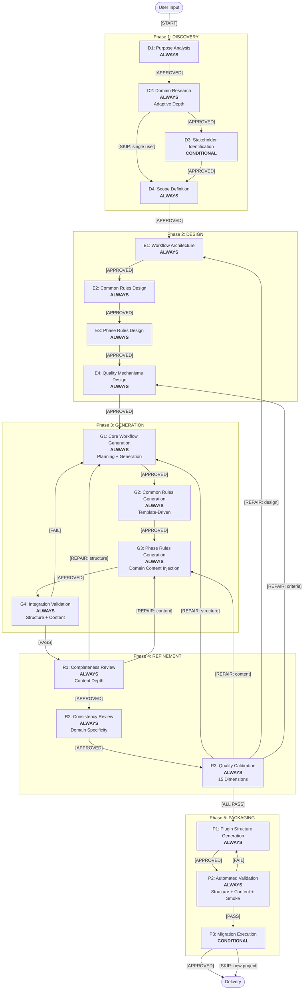

# Workflow Architecture

## Architecture Overview
- **Agent Type**: Process Agent
- **Base Pattern**: Plan → Approve → Execute → Verify（Process Agent標準パターン）
- **Total Phases**: 5（DISCOVERY → DESIGN → GENERATION → REFINEMENT → PACKAGING）
- **Total Stages**: 18（ALWAYS: 16, CONDITIONAL: 2）
- **Checkpoints**: 18（全ステージ末尾にユーザー承認ゲート）
- **品質次元**: 15（既存11 + 新規4）
- **改善方針**: 既存4フェーズ×15ステージ構造をベースに、スキル化（PACKAGING Phase）と自動テスト（Automated Validation Stage）を追加。各ステージの内部メカニズムを強化。

---

## Workflow Visualization

### Mermaid Diagram



### Text Alternative

```
Phase 1: DISCOVERY
  D1: Purpose Analysis (ALWAYS) → [APPROVED]
  D2: Domain Research (ALWAYS, Adaptive Depth) → [APPROVED]
  D3: Stakeholder Identification (CONDITIONAL) → [APPROVED] / [SKIP]
  D4: Scope Definition (ALWAYS) → [APPROVED]

Phase 2: DESIGN
  E1: Workflow Architecture (ALWAYS) → [APPROVED]
  E2: Common Rules Design (ALWAYS) → [APPROVED]
  E3: Phase Rules Design (ALWAYS) → [APPROVED]
  E4: Quality Mechanisms Design (ALWAYS) → [APPROVED]

Phase 3: GENERATION
  G1: Core Workflow Generation (ALWAYS) → [APPROVED]
  G2: Common Rules Generation (ALWAYS) → [APPROVED]
  G3: Phase Rules Generation (ALWAYS) → [APPROVED]
  G4: Integration Validation (ALWAYS) → [PASS] / [FAIL→G1]

Phase 4: REFINEMENT
  R1: Completeness Review (ALWAYS) → [APPROVED] / [REPAIR→G1/G3]
  R2: Consistency Review (ALWAYS) → [APPROVED]
  R3: Quality Calibration (ALWAYS, 15 Dimensions) → [ALL PASS] / [REPAIR→修復判断ツリー]

Phase 5: PACKAGING
  P1: Plugin Structure Generation (ALWAYS) → [APPROVED]
  P2: Automated Validation (ALWAYS) → [PASS] / [FAIL→P1]
  P3: Migration Execution (CONDITIONAL) → [APPROVED] / [SKIP] → Delivery

Repair Loop: max 3回。同一ターゲットへの2回目の戻りでユーザーエスカレーション。
```

### ラベル規約

| ラベル | 意味 |
|--------|------|
| `[START]` | ワークフロー開始 |
| `[APPROVED]` | 承認ゲート通過 |
| `[SKIP: {理由}]` | CONDITIONAL ステージのスキップ |
| `[PASS]` / `[FAIL]` | バリデーション結果 |
| `[ALL PASS]` | 全品質次元PASS |
| `[REPAIR: {分類}]` | 修復ループ（structure/content/design/criteria） |

---

## Phase Definitions

### Phase 1: DISCOVERY

**Purpose**: ターゲットエージェントの目的・ドメイン・スコープを理解する
**Focus**: WHAT（何を作るか）とWHY（なぜ作るか）の明確化
**Entry Criteria**: ユーザーからのポリシー生成リクエスト
**Exit Criteria**: Purpose Analysis、Domain Research、Scope Definitionの全承認完了

#### Stages

| Stage | Classification | Purpose | Approval Gate | Adaptive Depth |
|-------|---------------|---------|---------------|----------------|
| D1: Purpose Analysis | ALWAYS | エージェントの種類・能力・複雑度を分析 | Yes | No |
| D2: Domain Research | ALWAYS | ドメイン固有のベストプラクティス・ピットフォール・標準を調査 | Yes | Yes（Minimal/Standard/Comprehensive） |
| D3: Stakeholder Identification | CONDITIONAL | 複数ユーザータイプの特定と要件マッピング | Yes | No |
| D4: Scope Definition | ALWAYS | ポリシーセットの境界・見積もり・品質目標を定義 | Yes | No |

**CONDITIONAL判定基準（D3: Stakeholder Identification）**:
- Execute IF: 複数ユーザータイプ、異なるニーズ、クロスファンクショナルチーム、ロールベース動作
- Skip IF: 単一ユーザータイプ、単純なインタラクションパターン

#### 改善ポイント（vs 現行）

| 項目 | 現行 | 改善後 | 対象ステップ |
|------|------|--------|------------|
| Domain Research深度 | 3段階定義あり、実行はやや浅い | Adaptive Depthの各レベルに最低調査項目数を定義: Minimal(3項目), Standard(7項目), Comprehensive(12項目)。各項目にMCPツール指定（Context7→公式ドキュメント、Exa→Web調査、gh search→実装例） | D2 Step 2-3 |
| Scope Definitionの精度 | 推定ベース | 既存ファイルの`wc -l`実測値を取得し、改善後の行数差分を算出。マイグレーション計画にはファイルパスマッピング表を含む | D4 Step 3-4 |
| Purpose Analysisの深度 | 基本分類のみ | 4エージェントタイプ別の分析テンプレートを用意し、タイプ固有の分析観点を漏れなく確認 | D1 Step 2 |

---

### Phase 2: DESIGN

**Purpose**: ステアリングポリシーのアーキテクチャを設計する
**Focus**: HOW（どう作るか）の構造設計
**Entry Criteria**: DISCOVERY Phase全ステージ承認完了
**Exit Criteria**: Workflow Architecture、Common Rules Design、Phase Rules Design、Quality Mechanisms Designの全承認完了

#### Stages

| Stage | Classification | Purpose | Approval Gate | Adaptive Depth |
|-------|---------------|---------|---------------|----------------|
| E1: Workflow Architecture | ALWAYS | フェーズ/ステージ構造・依存関係・チェックポイント設計 | Yes | No |
| E2: Common Rules Design | ALWAYS | 共通ルールの選定・ドメイン適応・ウェルカムメッセージ設計 | Yes | No |
| E3: Phase Rules Design | ALWAYS | 各フェーズのルールファイル構造・内容アウトライン設計 | Yes | No |
| E4: Quality Mechanisms Design | ALWAYS | チェックポイント・監査・バリデーション・15品質次元設計 | Yes | No |

#### 改善ポイント（vs 現行）

| 項目 | 現行 | 改善後 |
|------|------|--------|
| 品質次元 | AI-DLC 11次元 | 15次元（+ドメイン特化率、具体例カバレッジ、テンプレート完備、ピットフォール参照率） |
| Quality Mechanisms | チェックリストベース | 修復判断ツリー付き（品質次元→問題分類マッピング） |
| Plugin設計 | なし | Phase Rules DesignでPACKAGINGフェーズのルール構造も設計 |

---

### Phase 3: GENERATION

**Purpose**: 設計に基づいてポリシーファイルを生成する
**Focus**: 承認済み設計の忠実な実装
**Entry Criteria**: DESIGN Phase全ステージ承認完了
**Exit Criteria**: 全ポリシーファイル生成完了 + Integration Validation PASS

#### Stages

| Stage | Classification | Purpose | Approval Gate | Adaptive Depth |
|-------|---------------|---------|---------------|----------------|
| G1: Core Workflow Generation | ALWAYS | core-workflow.md生成（Planning + Generation 2パート） | Yes | Yes（Minimal/Standard/Comprehensive） |
| G2: Common Rules Generation | ALWAYS | 共通ルールファイル群の生成（テンプレート駆動） | Yes | No |
| G3: Phase Rules Generation | ALWAYS | フェーズ別ルールファイル群の生成（ドメインコンテンツ注入） | Yes | Yes（適応的深度） |
| G4: Integration Validation | ALWAYS | 構造 + コンテンツ品質 + 自動テスト（構造テスト・コンテンツテスト） | Pass/Fail | No |

#### 改善ポイント（vs 現行）— 最重要改善領域

| 項目 | 現行 | 改善後 |
|------|------|--------|
| 成果物テンプレート | なし（25%カバー） | Light/Medium/Heavy例付きテンプレート（100%カバー） |
| ドメインコンテンツ | 汎用的な記述が多い | ドメイン固有コンテンツ注入ヒューリスティクス |
| 適応的深度 | core-workflowのみ | 全GENERATIONステージに適用 |
| Integration Validation | 構造チェックのみ | 3層テスト: 構造テスト + コンテンツテスト + スモークテスト |
| 弱点検出ループ | なし | Integration Validation FAIL時の自動フィードバックループ |

**新規メカニズム: ドメインコンテンツ注入ヒューリスティクス**

Phase Rules Generation (G3) 時に以下のプロセスでドメイン固有コンテンツを注入:

1. Domain Research Summaryからピットフォール・ベストプラクティスを抽出
2. 各Phase Ruleファイルの該当セクション（Error Handling, Steps, Examples）にマッピング
3. 具体例（GOOD/BAD例）を最低2つずつ挿入
4. エラーハンドリングセクションにピットフォール由来のシナリオを追加
5. ドメイン特化率を測定（Dim 12の測定方法に従う）し、40%未満なら追加注入

**新規メカニズム: Integration Validation 3層テスト**

| テスト層 | 実行タイミング | 内容 | 合否基準 |
|---------|-------------|------|---------|
| 構造テスト | G4 | ファイル存在、相互参照整合性、Markdown構文、フローパス完走 | エラー0件 |
| コンテンツテスト | G4 | ドメイン特化率(>=40%)、具体例数(>=2/file)、テンプレート有無(100%) | 全項目閾値以上 |
| スモークテスト | G4 | 生成core-workflow.mdの全ステージを仮想的にたどり、4エージェントタイプ（Process/Task/Analytical/Hybrid）でブロッキング不整合がないことを確認 | ブロッキングエラー0件 |

---

### Phase 4: REFINEMENT

**Purpose**: 生成されたポリシーセットのAI-DLC品質保証
**Focus**: 品質検証・修正・最終キャリブレーション
**Entry Criteria**: GENERATION Phase全ステージ完了 + Integration Validation PASS
**Exit Criteria**: 15品質次元全PASS + ユーザー最終承認

#### Stages

| Stage | Classification | Purpose | Approval Gate | Adaptive Depth |
|-------|---------------|---------|---------------|----------------|
| R1: Completeness Review | ALWAYS | ワークフローパス網羅性 + コンテンツ深度検証 | Yes | No |
| R2: Consistency Review | ALWAYS | 用語統一 + 構造パターン一貫性 + ドメイン特化率測定 | Yes | No |
| R3: Quality Calibration | ALWAYS | 15品質次元スコアリング + 修復判断ツリー | Yes（最終） | No |

#### 改善ポイント（vs 現行）— 重要改善領域

| 項目 | 現行 | 改善後 |
|------|------|--------|
| 品質次元数 | 11 | 15（+4新規次元） |
| Completeness | 構造完全性のみ | 構造 + コンテンツ深度検証（テンプレート有無、具体例数） |
| Consistency | 用語・フォーマット | + ドメイン特化率測定（各ファイル40%以上） |
| Quality Calibration | Pass/Partial/Fail | + 修復判断ツリー（品質次元→問題分類→戻り先） |
| 修復ループ | 手動でGENERATION戻り | 自動分類 + 最大3回制限 + エスカレーション |
| R1の戻り先 | 一律G1 | 修復判断ツリーで分岐（構造→G1、コンテンツ→G3） |

**新規メカニズム: 修復判断ツリー（R1/R3共通）**

```
FAIL / Gap detected
├── 構造的問題（ファイル欠落、参照切れ、フロー断絶）
│   → GENERATION Phase G1 (Core Workflow) へ戻る
├── コンテンツ問題（ドメイン特化率不足、具体例不足、テンプレート欠如）
│   → GENERATION Phase G3 (Phase Rules) へ戻る
├── 設計問題（フェーズ構造不適切、ステージ分類誤り）
│   → DESIGN Phase E1 (Workflow Architecture) へ戻る
└── 品質基準問題（次元定義の不備）
    → DESIGN Phase E4 (Quality Mechanisms) へ戻る
```

**品質次元→問題分類マッピング**

| FAIL次元 | 問題分類 | 戻り先 | 根拠 |
|---------|---------|-------|------|
| Dim 1 (Adaptive Workflow) | 設計問題 | E1 | ステージ分類の誤り |
| Dim 2 (Mandatory Checkpoints) | 構造的問題 | G1 | core-workflowのCP定義漏れ |
| Dim 3 (Question File Format) | コンテンツ問題 | G3 | Phase Ruleの質問形式不備 |
| Dim 4 (Content Validation) | コンテンツ問題 | G3 | バリデーションルール不足 |
| Dim 5 (Audit Trail) | 構造的問題 | G1 | state tracking設計の不備 |
| Dim 6 (Error Handling) | コンテンツ問題 | G3 | エラーシナリオ不足 |
| Dim 7 (Overconfidence Prevention) | コンテンツ問題 | G3 | ガイダンス不足 |
| Dim 8 (Depth Levels) | コンテンツ問題 | G3 | 深度定義不足 |
| Dim 9 (Session Continuity) | 構造的問題 | G1 | state file設計の不備 |
| Dim 10 (Terminology) | コンテンツ問題 | G2 | 用語集の不備 |
| Dim 11 (Completion Messages) | コンテンツ問題 | G3 | メッセージ形式不備 |
| Dim 12 (Domain Specificity) | コンテンツ問題 | G3 | ドメイン固有コンテンツ不足 |
| Dim 13 (Example Coverage) | コンテンツ問題 | G3 | 具体例不足 |
| Dim 14 (Artifact Template) | コンテンツ問題 | G2/G3 | テンプレート欠如 |
| Dim 15 (Pitfall Reference) | コンテンツ問題 | G3 | ピットフォール参照不足 |

**修復ループ制御ルール**

| ルール | 内容 |
|--------|------|
| 最大修復回数 | 3回（全体） |
| 同一ターゲット制限 | 同じステージへの2回目の戻りでユーザーエスカレーション |
| エスカレーション | 「修復ループが{N}回目です。続行/中断/スコープ変更 を選択してください」 |
| 履歴記録 | Repair Loop History（steering-state.md）に全ループを記録 |

---

### Phase 5: PACKAGING

**Purpose**: 生成・検証済みポリシーをClaude Codeプラグイン形式にパッケージングする
**Focus**: スキル化・マーケットプレイス対応・マイグレーション
**Entry Criteria**: REFINEMENT Phase全次元PASS
**Exit Criteria**: プラグイン構造生成完了 + Automated Validation PASS + マイグレーション完了（該当時）

#### Stages

| Stage | Classification | Purpose | Approval Gate | Adaptive Depth |
|-------|---------------|---------|---------------|----------------|
| P1: Plugin Structure Generation | ALWAYS | plugin.json, agents/, skills/, commands/, rules/ の生成 | Yes | No |
| P2: Automated Validation | ALWAYS | 構造テスト + コンテンツテスト + スモークテスト（プラグイン全体） | Pass/Fail | No |
| P3: Migration Execution | CONDITIONAL | 既存 `.steering/` → `steering-policy-maker/` へのマイグレーション | Yes | No |

**CONDITIONAL判定基準（P3: Migration Execution）**:
- Execute IF: 既存ポリシーのブラッシュアップ（既存 `.steering/` が存在）
- Skip IF: 新規ポリシー生成（マイグレーション元がない）

#### P1: Plugin Structure Generation 詳細

生成対象ファイル（Scope Definitionに基づく）:

```
steering-policy-maker/
├── .claude-plugin/
│   ├── plugin.json                         # プラグインメタデータ
│   └── marketplace.json                    # マーケットプレイス公開メタデータ
├── agents/ (4ファイル)
│   ├── spm-orchestrator.md                 # メインオーケストレーター
│   ├── domain-researcher.md                # ドメイン調査専門
│   ├── policy-generator.md                 # ポリシー生成専門
│   └── quality-reviewer.md                 # 品質検証専門
├── skills/ (4 SKILL.md)
│   ├── steering-policy-creation/SKILL.md   # メインスキル
│   ├── domain-research/SKILL.md            # ドメイン調査スキル
│   ├── quality-calibration/SKILL.md        # 品質評価スキル
│   └── policy-templates/SKILL.md           # テンプレートスキル
├── commands/ (3ファイル)
│   ├── new-policy.md                       # /spm:new-policy
│   ├── resume-policy.md                    # /spm:resume-policy
│   └── validate-policy.md                  # /spm:validate-policy
├── rules/
│   └── spm-standards.md                    # 品質基準ルール
└── steering-rule-details/                  # GENERATION/REFINEMENTで改善済みのファイルをコピー
    ├── common/ (11ファイル)
    ├── discovery/ (4ファイル)
    ├── design/ (4ファイル)
    ├── generation/ (4ファイル)
    └── refinement/ (3ファイル)
```

#### P2: Automated Validation 詳細

| テスト層 | 内容 | 合否基準 |
|---------|------|---------|
| 構造テスト | plugin.json必須フィールド確認、全参照ファイル存在確認、ディレクトリ構造検証 | エラー0件 |
| コンテンツテスト | SKILL.md行数制限(75-150行)、core-workflow行数(200-600行)、各ruleファイル行数(50-300行) | 全ファイル範囲内 |
| スモークテスト | `/spm:new-policy` コマンドで4エージェントタイプ（Process/Task/Analytical/Hybrid）の簡易生成を試行し、core-workflowの全ステージを仮想的にたどれることを確認 | ブロッキングエラー0件 |

#### P3: Migration Execution 詳細

マイグレーション方針（Scope Definitionより）:
1. GENERATION/REFINEMENTで改善済みの `.steering/` 内ファイルを `steering-policy-maker/steering-rule-details/` にコピー
2. 既存 `.steering/` はレガシーとして非推奨化（削除はしない）
3. マイグレーション完了後、READMEに新旧構造の対応表を追加

---

## Stage Dependency Map

### Phase内依存（Sequential）

```
DISCOVERY:  D1 → D2 → [D3] → D4
DESIGN:     E1 → E2 → E3 → E4
GENERATION: G1 → G2 → G3 → G4
REFINEMENT: R1 → R2 → R3
PACKAGING:  P1 → P2 → [P3]
```

### Phase間依存（Forward-only）

| From | To | Type | Description |
|------|-----|------|-------------|
| D4 (Scope Definition) | E1 (Workflow Architecture) | Required | スコープがアーキテクチャの入力 |
| E4 (Quality Mechanisms) | G1 (Core Workflow Gen) | Required | 品質設計がGENERATIONの基準 |
| G4 (Integration Validation) | R1 (Completeness Review) | Required | 構造検証PASSがREFINEMENT前提 |
| R3 (Quality Calibration) | P1 (Plugin Structure Gen) | Required | 15次元全PASSがPACKAGING前提 |
| D2 (Domain Research) | G3 (Phase Rules Gen) | Reference | ドメインコンテンツ注入の参照元 |
| E4 (Quality Mechanisms) | R3 (Quality Calibration) | Reference | 品質次元定義の参照元 |
| D4 (Scope Definition) | P1 (Plugin Structure Gen) | Reference | プラグイン構造の設計元 |

### 逆方向依存（Repair Loop）

| From | To | Condition | Max Retries |
|------|-----|-----------|-------------|
| G4 (Integration Validation) | G1 (Core Workflow Gen) | Validation FAIL | 3回（全体） |
| R1 (Completeness Review) | G1 or G3 | Gaps found（修復判断ツリーで分岐） | 同上 |
| R3 (Quality Calibration) | G1/G2/G3/E1/E4 | FAIL（品質次元マッピングで分岐） | 同上 |
| P2 (Automated Validation) | P1 (Plugin Structure Gen) | Validation FAIL | 2回 |

---

## Checkpoint Map

| ID | Location | Type | 合格基準 |
|----|----------|------|---------|
| CP-01 | After D1: Purpose Analysis | Approval | Agent Type確定、Complexity評価完了、Core Capabilities 3カテゴリ記載 |
| CP-02 | After D2: Domain Research | Approval | ベストプラクティス>=5、ピットフォール>=3、関連標準>=2 |
| CP-03 | After D3: Stakeholder ID | Approval/Skip | ユーザータイプ別要件マップ完成 / スキップ理由記録済み |
| CP-04 | After D4: Scope Definition | Approval | In/Out Scope明記、推定行数記載、品質目標Level定義済み |
| CP-05 | After E1: Workflow Architecture | Approval | フェーズ/ステージ表完成、依存図完成、チェックポイントマップ完成 |
| CP-06 | After E2: Common Rules Design | Approval | 共通ルール一覧（適用/非適用の判定理由付き）完成 |
| CP-07 | After E3: Phase Rules Design | Approval | 全ルールファイルの構造・内容アウトライン完成 |
| CP-08 | After E4: Quality Mechanisms | Approval | 15品質次元の定義・閾値・測定方法が全て記載 |
| CP-09 | After G1: Core Workflow Gen | Approval | core-workflow.md生成完了、全ステージ・CP記載確認 |
| CP-10 | After G2: Common Rules Gen | Approval | 全共通ルールファイル生成完了、相互参照確認 |
| CP-11 | After G3: Phase Rules Gen | Approval | 全Phase Ruleファイル生成完了、ドメイン特化率>=40%確認 |
| CP-12 | After G4: Integration Validation | Pass/Fail | 3層テスト全PASS（構造エラー0件 AND コンテンツ閾値以上 AND スモーク通過） |
| CP-13 | After R1: Completeness Review | Approval | 全ワークフローパス検証完了、ギャップ0件 |
| CP-14 | After R2: Consistency Review | Approval | 用語一貫性100%、構造パターン一貫性確認 |
| CP-15 | After R3: Quality Calibration | Final Approval | 15品質次元全PASS |
| CP-16 | After P1: Plugin Structure Gen | Approval | プラグイン構造ファイル全生成完了 |
| CP-17 | After P2: Automated Validation | Pass/Fail | 3層テスト全PASS |
| CP-18 | After P3: Migration Execution | Approval/Skip | マイグレーション完了確認 / スキップ理由記録 |

---

## State Tracking Design

### steering-state.md 構造（改善版）

```markdown
# Steering Policy Maker — State

## Project Information
- **Target Agent**: [agent-name]
- **Agent Type**: [Process/Task/Analytical/Hybrid]
- **Domain**: [domain description]
- **Complexity**: [Simple/Standard/Complex]
- **Quality Target**: [Standard/Premium]
- **Created**: [ISO timestamp]
- **Last Updated**: [ISO timestamp]

## Phase Progress

### DISCOVERY PHASE
- [x] Purpose Analysis — COMPLETED [timestamp]
- [x] Domain Research — COMPLETED [timestamp] (depth: [Minimal/Standard/Comprehensive])
- [ ] Stakeholder Identification — SKIPPED (reason) / COMPLETED [timestamp]
- [x] Scope Definition — COMPLETED [timestamp]

### DESIGN PHASE
- [ ] Workflow Architecture — [STATUS] [timestamp]
- [ ] Common Rules Design — [STATUS]
- [ ] Phase Rules Design — [STATUS]
- [ ] Quality Mechanisms Design — [STATUS]

### GENERATION PHASE
- [ ] Core Workflow Generation — [STATUS]
- [ ] Common Rules Generation — [STATUS]
- [ ] Phase Rules Generation — [STATUS]
- [ ] Integration Validation — [STATUS] (result: [PASS/FAIL])

### REFINEMENT PHASE
- [ ] Completeness Review — [STATUS] (gaps: [N])
- [ ] Consistency Review — [STATUS] (issues: [N])
- [ ] Quality Calibration — [STATUS] (score: [N/15 PASS])

### PACKAGING PHASE
- [ ] Plugin Structure Generation — [STATUS]
- [ ] Automated Validation — [STATUS] (result: [PASS/FAIL])
- [ ] Migration Execution — [STATUS] / SKIPPED (reason)

## Current Position
- **Phase**: [DISCOVERY/DESIGN/GENERATION/REFINEMENT/PACKAGING]
- **Stage**: [Stage Name]
- **Step**: [Current step description]
- **Status**: [Awaiting/In Progress/Blocked]

## Repair Loop History
- [timestamp] Loop #[N]: [Source Stage] → [Target Stage]: [Reason] (dimension: [Dim #])

## Key Decisions
- [timestamp] [Decision description]
```

---

## 新規15品質次元一覧

### 既存11次元（AI-DLC標準）

| # | Dimension | Description |
|---|-----------|-------------|
| 1 | Adaptive Workflow | ステージがALWAYS/CONDITIONALに分類されている |
| 2 | Mandatory Checkpoints | 重要な決定点でユーザー承認がある |
| 3 | Question File Format | 多肢選択 + Other + [Answer]:タグ |
| 4 | Content Validation | ファイル作成前のバリデーションルール |
| 5 | Audit Trail | ISO 8601タイムスタンプ、完全なロギング |
| 6 | Error Handling | フェーズ固有のリカバリー手順 |
| 7 | Overconfidence Prevention | 不確実な場合は仮定せず質問する |
| 8 | Depth Levels | 複雑度に応じた適応的詳細度 |
| 9 | Session Continuity | 状態追跡と再開機能 |
| 10 | Terminology Standardization | 用語集の強制 |
| 11 | Standardized Completion Messages | REVIEW REQUIRED + WHAT'S NEXT形式 |

### 新規4次元（SPM品質強化）

| # | Dimension | Measurement Method | Threshold | 閾値根拠 |
|---|-----------|-------------------|-----------|---------|
| 12 | Domain Specificity Rate | 各Phase Ruleファイルを走査。ドメイン固有行の判定: (a) terminology.mdの用語を含む行、(b) Domain Research由来の固有名詞・手順を含む行、(c) 汎用テンプレート定型文を除外。計算: 該当行数 ÷ (総行数 - 空行 - 見出し行) | >= 40% | 既存10スキル分析でドメイン固有コンテンツが高品質スキルで平均45%、低品質で20%前後。40%を最低ライン |
| 13 | Example Coverage | 各Phase Ruleファイル内の GOOD例・BAD例・具体例 を含むコードブロック数をカウント | >= 2個/ファイル | 高品質スキル（frontend-slides, market-research等）は平均3-5例/セクション。2例を最低ライン |
| 14 | Artifact Template Completeness | 出力セクションを持つべきファイル（generation/*.md, refinement/*.md）のうち、テンプレートブロックが存在するファイル数 ÷ 対象ファイル数 | = 100% | 現行は25%（1/4 generationファイル）。テンプレートなしだと生成品質にばらつき |
| 15 | Pitfall Reference Rate | エラーハンドリングセクション内の項目のうち、domain-research-summary.mdのピットフォールリストを明示参照（ファイルパスまたはピットフォール名）している項目数 ÷ 全エラーハンドリング項目数 | >= 50% | ドメイン調査の成果がエラーハンドリングに反映されなければ調査の価値が半減 |

### 15次元の承認基準

| 判定 | 条件 |
|------|------|
| **APPROVED** | 15次元全PASS |
| **CONDITIONAL APPROVAL** | 13次元以上PASS、FAIL次元がDim 12-15のみ |
| **NEEDS REMEDIATION** | 12次元以下PASS、またはDim 1-11にFAILあり |

---

## Key Design Decisions

### KDD-01: フェーズ構造拡張（4→5フェーズ）

- **Context**: 既存4フェーズ×15ステージ構造。Scope DefinitionでPhase 3としてスキル化・プラグイン化（15ファイル新規）が定義済み。
- **Decision**: Phase 5: PACKAGINGを追加し、5フェーズ×18ステージとする。
- **Alternatives**: (a) 既存GENERATIONのサブステップとして吸収, (b) REFINEMENT後のオプショナルステップ
- **Rationale**: スキル化は独立した関心事（ポリシー品質とパッケージ構造は別軸）。GENERATIONに混ぜるとステージの責務が曖昧になる。独立フェーズにすることで、ポリシー生成のみのユースケースではPACKAGINGをスキップ可能。
- **Consequences**: ステージ総数が15→18に増加。既存core-workflow.mdの改訂範囲が拡大。

### KDD-02: 15品質次元

- **Context**: 既存11次元（AI-DLC標準）ではコンテンツ品質を定量測定できない。Domain Researchで「GENERATION/REFINEMENT品質が低い」根因はコンテンツ深度の不足と判明。
- **Decision**: 4次元（ドメイン特化率、具体例カバレッジ、テンプレート完備、ピットフォール参照率）を追加。
- **Rationale**: 既存11次元は構造・プロセス寄り。新4次元はコンテンツ品質を定量化し、GENERATION品質改善の達成を測定可能にする。
- **Consequences**: REFINEMENT Phase工数が増加。測定手法の定義が必要（本ドキュメントに記載済み）。

### KDD-03: 修復判断ツリー + ループ制限

- **Context**: 現行ではQuality Calibration FAILの戻り先が手動判断。無限ループのリスクあり。
- **Decision**: 品質次元→問題分類→戻り先の自動マッピング + 最大3回 + 同一ターゲット2回でエスカレーション。
- **Rationale**: 自動分類で判断の一貫性を確保。ループ制限でセッション長の暴走を防止。
- **Consequences**: 修復ループが3回で強制終了する場合、品質が閾値未満のまま納品される可能性がある。エスカレーションでユーザーに判断を委ねることで対応。

### KDD-04: ドメインコンテンツ注入

- **Context**: Domain Researchの成果（ベストプラクティス、ピットフォール）がGENERATIONに構造的に注入されていなかった。
- **Decision**: G3（Phase Rules Generation）に5ステップの注入ヒューリスティクスを追加。
- **Rationale**: Domain Researchは全ケースで実行されるが、その成果の活用がGENERATION実行者の裁量に依存していた。構造的プロセスにすることで漏れを防止。

### KDD-05: 自動テスト3層アーキテクチャ

- **Context**: Scope Definitionで「構造テスト + コンテンツテスト + 動作テスト」が要件。Purpose Analysisで「自動テスト・検証機能」が追加機能として記録。
- **Decision**: G4（Integration Validation）に構造テスト+コンテンツテストを組み込み、P2（Automated Validation）にプラグイン全体のスモークテストを配置。
- **Alternatives**: (a) 独立したテストフェーズを追加, (b) REFINEMENT内に組み込み
- **Rationale**: 構造・コンテンツテストはポリシー生成直後に実行すべき（早期フィードバック）。スモークテスト（動作テスト）はプラグイン構造完成後に実行すべき。2段階に分けることで適切なタイミングでテスト実行。
- **Consequences**: validation agentの実装が必要（P2ステージで使用）。Scope Definitionの「validation agent」はP2のコンテキストで実装される。

### KDD-06: テンプレート駆動生成

- **Context**: 現行GENERATIONはテンプレートなしで生成しており、品質にばらつき。
- **Decision**: Common Rules Generation（G2）にLight/Medium/Heavyテンプレートを導入。
- **Rationale**: テンプレートにより生成品質の下限を保証。Light（Simple Agent）、Medium（Standard）、Heavy（Complex）で適応。
