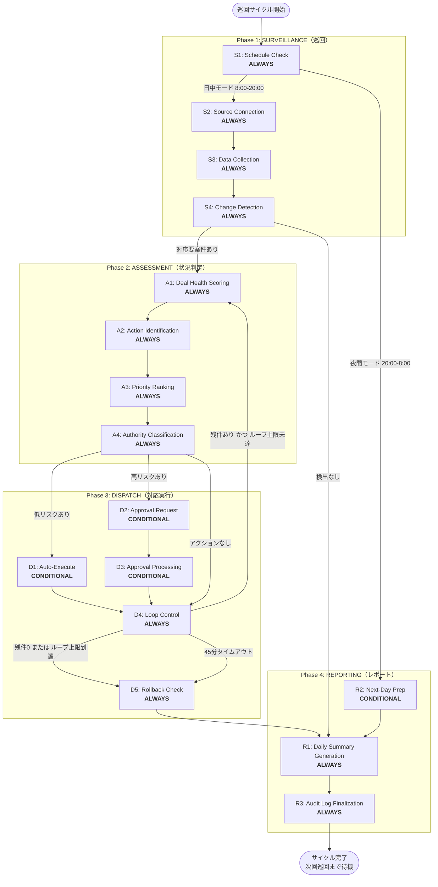

# Workflow Architecture

## Architecture Overview
- **Agent Type**: Hybrid Agent
- **Base Pattern**: 巡回→状況把握→対応判定→ディスパッチ→ループ→レポートのサイクル型
- **Operational Phases**: 4（SURVEILLANCE, ASSESSMENT, DISPATCH, REPORTING）
- **Build-Time Phase**: PACKAGING（ビルドタイム分離）
- **Operational Stages**: 16（ALWAYS: 12, CONDITIONAL: 4）
- **Build-Time Stages**: 2
- **Checkpoints**: 8〜10

## Hybrid特性

本エージェントは2軸のHybrid設計を持つ:

1. **時間帯モード切り替え軸**: 日中モード（8:00-20:00）は1時間サイクルで巡回→検出→対応ループ。夜間モード（20:00-8:00）は翌日準備タスク実行と日次サマリー生成に切り替わる
2. **アクション自律度切り替え軸**: 低リスクアクション（Salesforce Activityログ記録・内部リマインダー送信）は自動実行。高リスクアクション（顧客へのメール送信・商談金額変更・ステージ変更）は必ず承認制

## Workflow Visualization



### Text Alternative

```
Phase 1: SURVEILLANCE（巡回）
  S1: Schedule Check (ALWAYS)
    ├─ 日中モード（8:00-20:00）→ S2: Source Connection
    └─ 夜間モード（20:00-8:00）→ R2: Next-Day Prep（直接Phase 4へ）

  S2: Source Connection (ALWAYS) → S3: Data Collection (ALWAYS) → S4: Change Detection (ALWAYS)
    ├─ 対応要案件あり → Phase 2: ASSESSMENT
    └─ 検出なし → R1: Daily Summary Generation（Phase 4）

Phase 2: ASSESSMENT（状況判定）
  A1: Deal Health Scoring (ALWAYS)
  → A2: Action Identification (ALWAYS)
  → A3: Priority Ranking (ALWAYS)
  → A4: Authority Classification (ALWAYS)
    ├─ 低リスクあり → D1: Auto-Execute (CONDITIONAL)
    ├─ 高リスクあり → D2: Approval Request (CONDITIONAL)
    └─ アクションなし → D4: Loop Control

Phase 3: DISPATCH（対応実行）
  D1: Auto-Execute → D4: Loop Control
  D2: Approval Request → D3: Approval Processing → D4: Loop Control
  D4: Loop Control
    ├─ 残件あり かつ ループ上限未達（最大5ループ） → A1 に戻る
    ├─ 残件0 または ループ上限到達 → D5: Rollback Check
    └─ 45分タイムアウト → D5: Rollback Check
  D5: Rollback Check → Phase 4: REPORTING

Phase 4: REPORTING（レポート）
  R1: Daily Summary Generation (ALWAYS)
  R2: Next-Day Prep (CONDITIONAL) — 夜間モード時
  R3: Audit Log Finalization (ALWAYS)

Build-Time: PACKAGING（運用フローとは独立）
  P1: Plugin Structure Generation (ALWAYS)
  P2: Automated Validation (ALWAYS)
```

## Phase Definitions

### Phase 1: SURVEILLANCE（巡回）
**Purpose**: 4データソース（Salesforce / Gmail / Google Calendar / Slack）を定期巡回し、対応要件を持つ変更・異常を検出する
**Focus**: データ収集の完全性・正確性、統合ビューの構築
**Entry Criteria**: 巡回サイクルのスケジュールに達している、または手動トリガーが実行された
**Exit Criteria**: 全ソースの収集が完了（部分障害時は利用可能ソースのみ）し、変更検出リストが確定している

#### Stages:
| Stage | Classification | Purpose | Approval Gate |
|-------|---------------|---------|---------------|
| S1: Schedule Check | ALWAYS | 時間帯判定（日中/夜間）、前回サイクルの完了確認、API使用量確認 | Yes（CP-1） |
| S2: Source Connection | ALWAYS | 4ソース接続・OAuth認証確認・トークンリフレッシュ | No |
| S3: Data Collection | ALWAYS | 差分データ収集・統合ビュー構築・ソース間整合性チェック | No |
| S4: Change Detection | ALWAYS | 7種の変更検出（停滞/未返信/会議準備/金額変動/期限接近/未追跡リード/ステータス未反映） | Yes（CP-2） |

**S1 時間帯モード判定**:
- 日中モード（8:00-20:00、JST、平日）: 1時間サイクル巡回→ASSESSMENT→DISPATCHループ
- 夜間モード（20:00-8:00、祝日含む）: 翌日準備タスク実行（R2）→日次サマリー生成（R1）
- 営業時間外の顧客向けアクション（メール送信等）は翌営業日に自動繰り延べ

**S1 API使用量確認（Pitfall 4対策）**:
- Salesforce API使用率を確認
- 使用率80%超: セーフモード切り替え（巡回頻度を2時間間隔に低下）
- 使用率95%超: 読み取り専用モード（更新系APIをブロック、巡回のみ続行）

**S3 統合ビュー構築（Pitfall 5対策）**:
- 4ソースの情報をタイムスタンプベースで最新優先にマージ
- ソース間矛盾検出: 例「SalesforceでClosedだがGmailで商談継続中」→矛盾フラグを付与し、Assessment時に人間判断を仰ぐ
- 部分障害フォールバック: 1〜3ソースが利用不可でも利用可能ソースで巡回を続行。障害ソースを明記してレポートに記録（Pitfall 4対策）

**S4 7種変更検出ルール（Pitfall 1対策）**:
- 停滞商談: 同一ステージに滞留日数が閾値（デフォルト: Proposalステージ14日、Negotiationステージ7日）超過 **かつ** Gmail/Slackで直近アクティビティなし（多層判定）
- 未返信: 送信メールへの返信が3営業日超過
- 会議準備: Google Calendar予定が24時間以内 かつ Salesforce商談と紐づきあり
- 金額変動: Salesforce商談の金額フィールドが前回巡回比で変化
- 期限接近: クロージング日まで7日以内
- 未追跡リード: Gmail/CalendarでやりとりがあるがSalesforceにリードや商談が存在しない
- ステータス未反映: Gmailでメール送受信またはCalendarでミーティング実施があるが、SalesforceのActivityに記録なし

### Phase 2: ASSESSMENT（状況判定）
**Purpose**: 検出された変更・異常を評価し、対応アクションを特定、優先度付け、自動実行/承認制の分類を行う
**Focus**: 正確な商談ヘルス評価と、過不足ない対応アクションの特定
**Entry Criteria**: S4の変更検出リストが確定している
**Exit Criteria**: 対応アクションリスト（自動実行/承認制の分類済み）が確定している

#### Stages:
| Stage | Classification | Purpose | Approval Gate |
|-------|---------------|---------|---------------|
| A1: Deal Health Scoring | ALWAYS | 商談ヘルススコア算出（停滞度・エンゲージメント・期限リスクの複合評価） | No |
| A2: Action Identification | ALWAYS | 7種の検出結果から具体的な対応アクションを生成 | No |
| A3: Priority Ranking | ALWAYS | アクションの優先度スコアリング（商談金額×期限×ヘルススコア） | No |
| A4: Authority Classification | ALWAYS | 各アクションを自動実行/承認制に分類 | Yes（CP-3） |

**A1 商談ヘルススコア算出**:
- インプット: ステージ滞留日数、最終アクティビティからの経過日数、メール応答率、ミーティング頻度、クロージング日までの残日数、商談金額
- スコア範囲: 0-100（赤: 0-39 / 黄: 40-69 / 緑: 70-100）
- 多層判定: Salesforceで停滞スコア低でも、Gmail/Slackで直近アクティビティあればスコア補正（Pitfall 5対策）

**A4 自動実行/承認制の境界（Pitfall 2対策）**:
- **自動実行（低リスク）**: Salesforce Activityログ記録、内部リマインダー送信、ステータスの前進更新（Prospecting→Qualification等）、会議準備サマリー生成
- **承認制（高リスク）**: 顧客へのメール送信、商談金額の変更、ステージの後退（Negotiation→Proposal等）、商談クローズ（Won/Lost）、新規リードの商談化、既存レコードの削除

### Phase 3: DISPATCH（対応実行）
**Purpose**: 分類されたアクションを実行し、ループ制御によって残件がなくなるまで対応を繰り返す
**Focus**: 安全な自動実行と、承認フローの適切な管理
**Entry Criteria**: A4のアクションリスト（分類済み）が確定している
**Exit Criteria**: 全アクションが実行済みまたは繰り延べ済み、ロールバックチェック完了

#### Stages:
| Stage | Classification | Purpose | Approval Gate |
|-------|---------------|---------|---------------|
| D1: Auto-Execute | CONDITIONAL（自動実行対象がある場合） | 低リスクアクションの自動実行 | No |
| D2: Approval Request | CONDITIONAL（承認制対象がある場合） | 高リスクアクションの承認リクエスト送信 | No |
| D3: Approval Processing | CONDITIONAL（承認済みアクションがある場合） | 承認結果の取得・実行 | Yes（CP-4） |
| D4: Loop Control | ALWAYS | 残件チェック、ループ上限・タイムアウト判定 | No |
| D5: Rollback Check | ALWAYS | 実行結果の検証・異常検出・ロールバック判定 | Yes（CP-5） |

**D1 自動実行の排他制御**:
- 同一商談レコードへの並行更新を防ぐため、商談IDレベルのロックを取得してから実行
- Salesforce APIのバルクAPI活用でガバナーリミット消費を最小化（Pitfall 4対策）

**D2/D3 承認フロー管理（Pitfall 2対策）**:
- 承認リクエスト送信後30分で自動リマインダー（Slackまたはメール）
- 2時間経過で未承認の場合: そのアクションを次サイクルへ繰り延べ（ブロックしない）
- 承認却下の場合: 却下理由を監査ログに記録し、類似アクションの自動判定ロジックを見直しフラグを立てる

**D4 ループ制御（Pitfall 2・Pitfall 3対策）**:
- **最大ループ回数**: 1巡回サイクルあたり最大5ループ（同一アクションリストに対する再評価）
- **タイムアウト**: 1サイクルの最大処理時間 45分（次の巡回開始まで15分バッファ）
- **新規検出の繰り延べ**: ループ中に新たに検出された案件は現サイクルのアクションリストに追加せず、次サイクルへ繰り延べ（Pitfall 3対策: 同一担当者への重複通知防止）
- ループ上限到達: D5へ進み、残件を次サイクルに繰り越し

**D5 ロールバック判定**:
- 自動実行後のSalesforceレコード状態を事前状態と比較
- 意図しない変更（例: 正常なStage前進のつもりが後退）を検出した場合、ロールバックAPIを呼び出して復元
- ロールバック実行時は担当者にSlack通知を送信し、監査ログに記録

### Phase 4: REPORTING（レポート）
**Purpose**: サイクル結果を集約し、日次サマリーを配信、監査ログを確定する
**Focus**: 情報の正確な集約とコンパクトな通知（通知疲れ防止）
**Entry Criteria**: DISPATCHサイクル完了またはS4で検出なし
**Exit Criteria**: 日次サマリー配信完了、監査ログ確定・保存完了

#### Stages:
| Stage | Classification | Purpose | Approval Gate |
|-------|---------------|---------|---------------|
| R1: Daily Summary Generation | ALWAYS | 当日対応状況 + 翌日優先タスクリスト + パイプラインヘルスサマリーの生成・配信 | Yes（CP-6） |
| R2: Next-Day Prep | CONDITIONAL（夜間モード時） | 翌日準備タスクの自動実行（会議準備サマリー、期限接近アラートの事前準備） | Yes（CP-7） |
| R3: Audit Log Finalization | ALWAYS | 本サイクルの全アクション履歴・承認記録・ロールバック記録を確定・保存 | No |

**R1 通知の階層化（Pitfall 3対策）**:
- 緊急（Slack DM即時）: クロージング日24時間以内の商談の異変、大型商談（¥10M以上）の停滞検出
- 重要（次回巡回サマリー集約）: 停滞商談検出、未返信フォロー必要
- 情報（日次ダイジェストに集約）: Activity自動記録完了、ステータス更新完了
- 同一商談への重複通知は最後の通知から4時間以内は抑制

**R2 翌日準備タスク（夜間モード）**:
- Google Calendarから翌営業日のミーティング予定を取得し、商談サマリー（Salesforce情報・直近メール・過去議事録）を事前生成
- 翌日クロージング期限の商談担当者へアラートを事前準備
- 夜間は顧客向けアクション（メール送信等）を実行しない

### Build-Time: PACKAGING（ビルドタイムフロー — 運用フローとは独立）
**Purpose**: 検証済みポリシーをClaude Codeプラグイン形式にパッケージング
**Note**: このフェーズはポリシー初期構築/更新時のみ実行。巡回サイクルのランタイムフローには含まれない。

| Stage | Classification | Purpose | Approval Gate |
|-------|---------------|---------|---------------|
| P1: Plugin Structure Generation | ALWAYS | plugin.json, agents, skills, commands生成 | Yes（CP-8） |
| P2: Automated Validation | ALWAYS | 3層テスト（構造+コンテンツ+スモーク） | Yes |

## Stage Dependency Map

| Stage | Depends On | Produces |
|-------|-----------|----------|
| S1 | スケジュールトリガー | 時間帯モード判定、API使用量状態 |
| S2 | S1（日中モード） | 4ソース接続状態、OAuthトークン |
| S3 | S2 | 統合ビュー、差分データ、矛盾フラグ |
| S4 | S3 | 変更検出リスト（7種） |
| A1 | S4 | 商談ヘルススコア |
| A2 | S4, A1 | 対応アクションリスト |
| A3 | A2, A1 | 優先度付きアクションリスト |
| A4 | A3 | 自動実行リスト + 承認制リスト |
| D1 | A4（低リスクあり） | 自動実行完了記録 |
| D2 | A4（高リスクあり） | 承認リクエスト送信記録 |
| D3 | D2（承認済みアクション） | 承認済みアクション実行完了記録 |
| D4 | D1 or D3 or A4（アクションなし） | ループ判定結果（継続/終了） |
| D5 | D4（終了判定） | ロールバック結果、検証済み実行記録 |
| R1 | D5 or S4（検出なし） | 日次サマリー、通知送信完了 |
| R2 | S1（夜間モード） | 翌日準備データ、事前生成サマリー |
| R3 | R1, R2 | 確定済み監査ログ |
| P1 | 全ポリシーファイル確定 | plugin.json, プラグイン構造 |
| P2 | P1 | テスト結果、検証レポート |

## Checkpoint Map

| CP | Location | Purpose | Criteria |
|----|----------|---------|----------|
| CP-1 | After S1 | スケジュール・API状態確認 | 時間帯モード確定、API使用率正常 |
| CP-2 | After S4 | 変更検出リスト確認 | 検出件数・種別・多層判定結果の妥当性 |
| CP-3 | After A4 | アクション分類確認 | 自動実行/承認制の境界が正しく適用されている |
| CP-4 | After D3 | 承認済みアクション実行前確認 | 承認内容と実行予定の一致 |
| CP-5 | After D5 | ロールバックチェック確認 | 異常なし or ロールバック完了 |
| CP-6 | After R1 | 日次サマリー確認 | 通知階層化・重複抑制が適用されている |
| CP-7 | After R2 | 翌日準備内容確認（夜間のみ） | 翌日ミーティングサマリー・アラート準備完了 |
| CP-8 | After P1 | プラグイン構造確認 | 構造・参照整合性 |

## Repair Judgment Tree

```
FAIL / Gap detected
├── Structural（ファイル欠損、参照切れ、フローブレーク）
│   → core-workflow再生成
├── Content（ドメイン特化率低、例不足、テンプレート不足）
│   → Phase Rules再生成 or Common Rules再生成
├── Design（フェーズ構造不適、ステージ分類誤り、ループ設計不備）
│   → Workflow Architecture再設計
└── Criteria（品質次元定義不備）
    → Quality Mechanisms再設計
```

### Domain固有リペアシナリオ

| 症状 | 分類 | 戻り先 |
|------|------|--------|
| 停滞商談の誤検出多発（Pitfall 1） | Content | change-detection.md 再生成（多層判定ロジック修正） |
| 承認制アクションが自動実行されている（Pitfall 2） | Content | action-authority.md + auto-execute.md 修正 |
| 通知が多すぎて担当者が無視（Pitfall 3） | Content | daily-summary-generation.md 修正（通知集約ルール強化） |
| Salesforce API 制限到達で巡回中断（Pitfall 4） | Design | schedule-check.md + loop-control.md 修正（セーフモード強化） |
| ソース間矛盾による誤判定（Pitfall 5） | Content | data-collection.md 修正（矛盾検出ロジック強化） |

## Loop Control Rules

| Rule | Value | Rationale |
|------|-------|-----------|
| Max loops / cycle | 5 | 無限ループ防止、1サイクルで対応しきれない件数は次サイクルへ |
| Cycle timeout | 45分 | 1時間サイクルに対して15分バッファを確保 |
| Approval timeout（リマインダー） | 30分 | 担当者の対応漏れ防止 |
| Approval timeout（繰り延べ） | 2時間 | 承認待ちでエージェントをブロックしない |
| 新規検出の扱い | 次サイクル繰り延べ | 現サイクル中の重複通知・対応件数爆発を防止 |
| Max retries（修復ループ） | 3 | コンテキスト爆発防止 |
| Same-target repair limit | 2 | 問題分類誤りの示唆 |

## State Tracking Design（巡回サイクル単位）

```markdown
# Sales Pipeline Agent — Cycle State

## Current Cycle
- **Cycle ID**: [UUID]
- **Start Time**: [ISO 8601]
- **Mode**: [daytime / nighttime]
- **API Usage**: [Salesforce: X%, Gmail: OK, Calendar: OK, Slack: OK]
- **Loop Count**: [0-5] / Max: 5
- **Elapsed**: [分] / Timeout: 45分

## Source Status
- **Salesforce**: [connected / auth_error / rate_limit / partial]
- **Gmail**: [connected / auth_error / partial]
- **Google Calendar**: [connected / auth_error / partial]
- **Slack**: [connected / auth_error / partial]

## Detection Summary
- **Total Detected**: [件数]
- **Stale Deals**: [件数] / Conflicts: [矛盾フラグ付き件数]
- **Unanswered Emails**: [件数]
- **Meeting Prep**: [件数]
- **Amount Changed**: [件数]
- **Deadline Approaching**: [件数]
- **Untracked Leads**: [件数]
- **Status Unrecorded**: [件数]

## Action Queue
- **Auto-Execute**: [件数] / Completed: [件数]
- **Pending Approval**: [件数] / Approved: [件数] / Rejected: [件数] / Deferred: [件数]
- **Remaining**: [件数]

## Processing History
- [timestamp] S1: Mode=daytime, API usage=Salesforce 45%
- [timestamp] S4: Detected 7 items (3 stale, 2 unanswered, 2 meeting-prep)
- [timestamp] A4: Auto=4, Approval=3
- [timestamp] D1: Auto-executed 4 actions (Activity logs: 4)
- [timestamp] D2: Approval requests sent (3 items)
- [timestamp] D3: Approved 2 / Rejected 1 / Timeout-deferred 0
- [timestamp] D4: Loop 1 complete, remaining=0 → exit
- [timestamp] D5: Rollback check OK (no anomalies)
- [timestamp] R1: Daily summary sent to #sales-pipeline (Slack)
- [timestamp] R3: Audit log finalized, cycle ID=[UUID]
```
